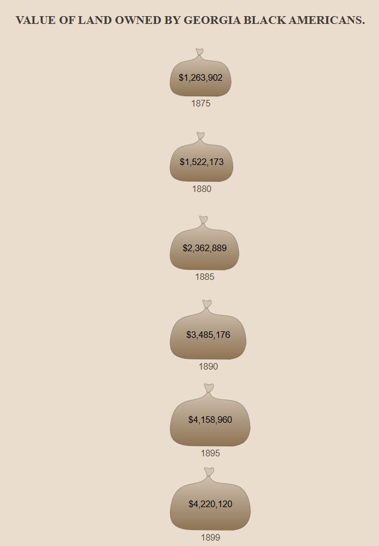
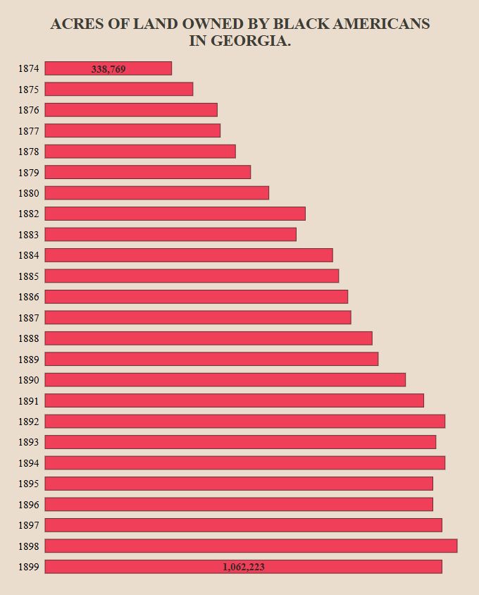
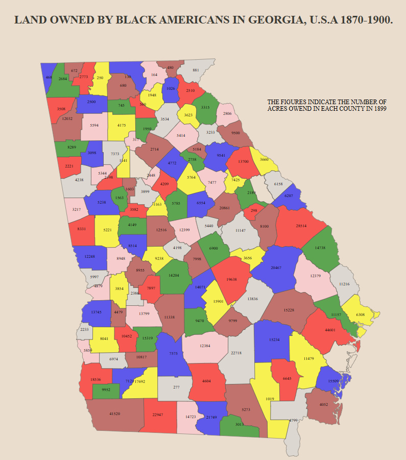
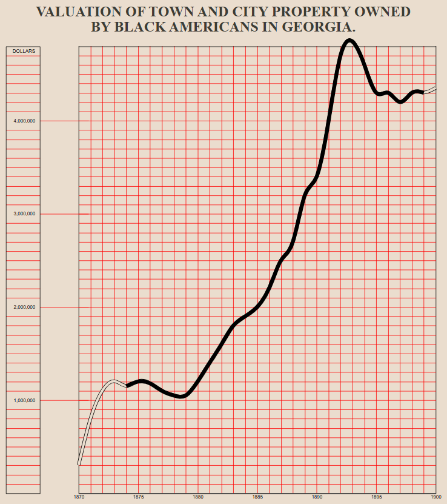
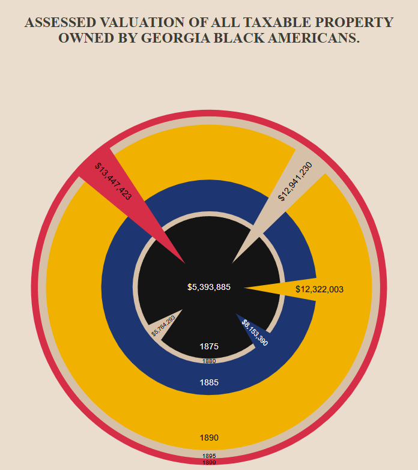
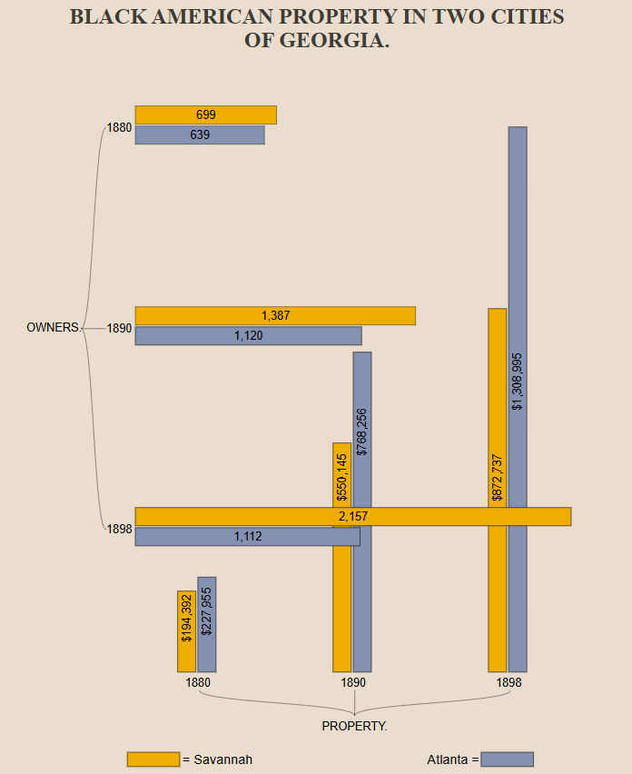
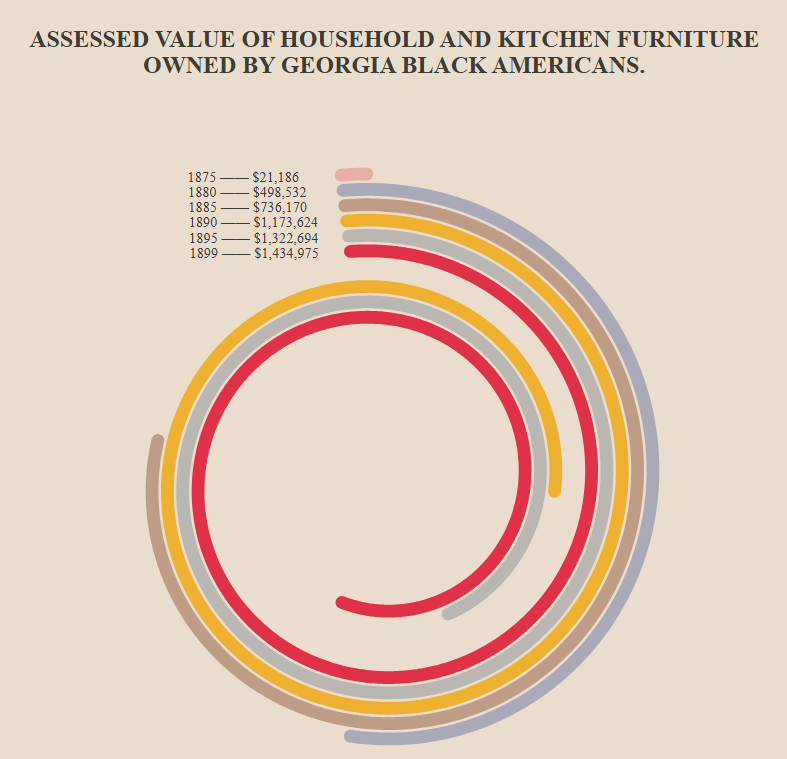
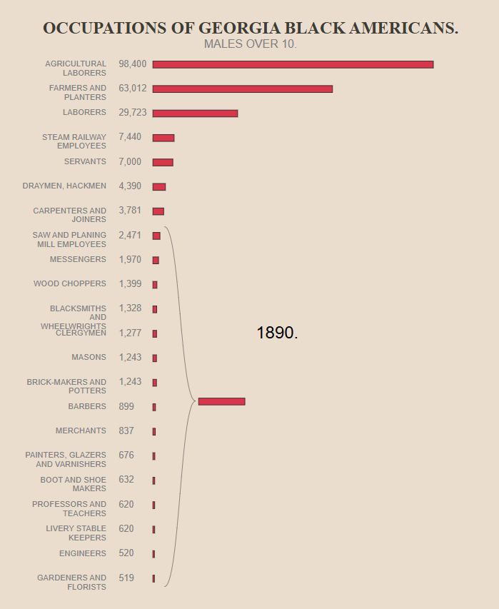
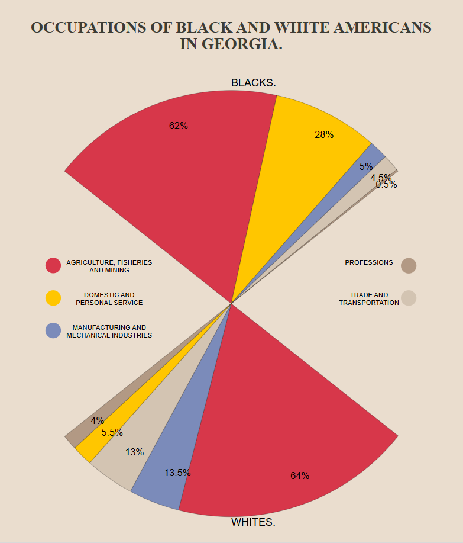
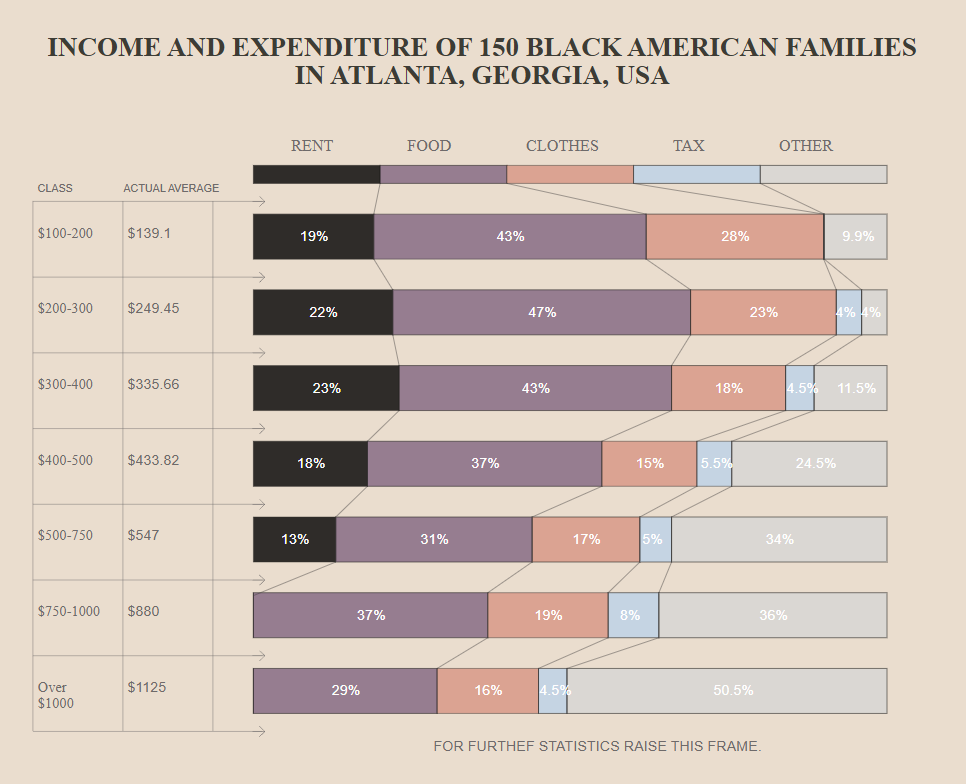

# [Deneb / Vega Showcase](../README.md)

This page is a part of me documenting my journey into learning [Vega](https://vega.github.io/vega/) and using [Deneb](https://deneb-viz.github.io/) for Power BI.

[👈 Go back to the main page of my Deneb / Vega Showcase](../README.md)

# Du Bois Challenge 2025

The goal of this challenge is to celebrate the data viz legacy of W.E.B Du Bois—a Black American civil rights activist, sociologist and writer—by recreating the visualizations from the 1900 Paris Exposition using modern tools.

This challenge was organized by the Data Visualization Society.
There are 10 different visualizations.

[View the original challenge](https://www.datavisualizationsociety.org/news/2025/2/3/2025-du-bois-visualization-challenge) 

**Challenges**

1. [Value of Land Owned by Georgia Black Americans](#challenge-1---value-of-land-owned-by-georgia-black-americans)
2. [Acres of Land Owned by Black Americans in Georgia](#challenge-2---acres-of-land-owned-by-black-americans-in-georgia)
3. [Land Owned by Black Americans in Georgia, USA, 1870-1900](#challenge-3---land-owned-by-black-americans-in-georgia-usa-1870-1900)
4. [Valuation of Town and City Property Owned by Black Americans in Georgia](#challenge-4---valuation-of-town-and-city-property-owned-by-black-americans-in-georgia)
5. [Assessed Valuation of all Taxable Property Owned by Georgia Black Americans](#challenge-5---assessed-valuation-of-all-taxable-property-owned-by-georgia-black-americans)
6. [Black American Property in Two Cities of Georgia](#challenge-5---assessed-valuation-of-all-taxable-property-owned-by-georgia-black-americans)
7. [Assessed Value of Household and Kitchen Furniture Owned by Georgia Black Americans](#challenge-7---assessed-value-of-household-and-kitchen-furniture-owned-by-georgia-black-americans)
8. [Occupations Of Georgia Black Americans](#challenge-8---occupations-of-georgia-black-americans)
9. [Occupations Of Black And White Americans In Georgia](#challenge-9---occupations-of-black-and-white-americans-in-georgia)
10. [Income and Expenditure of 150 Black American Families in Atlanta, GA, USA](#challenge-10---income-and-expenditure-of-150-black-american-families-in-atlanta-ga-usa)

## Challenge 1 - Value of Land Owned by Georgia Black Americans

[Open in Vega Editor](https://seealso.link/flynnxx1/VegaDB25-01)

## Challenge 2 - Acres of Land Owned by Black Americans in Georgia

[Open in Vega Editor](https://seealso.link/flynnxx1/VegaDB25-02)

## Challenge 3 - Land Owned by Black Americans in Georgia, USA, 1870-1900

[Open in Vega Editor](https://seealso.link/flynnxx1/VegaDB25-03)

## Challenge 4 - Valuation of Town and City Property Owned by Black Americans in Georgia

[Open in Vega Editor](https://seealso.link/flynnxx1/VegaDB25-04)

## Challenge 5 - Assessed Valuation of all Taxable Property Owned by Georgia Black Americans

[Open in Vega Editor](https://seealso.link/flynnxx1/VegaDB25-05)

## Challenge 6 - Black American Property in Two Cities of Georgia

[Open in Vega Editor](https://seealso.link/flynnxx1/VegaDB25-06)

## Challenge 7 - Assessed Value of Household and Kitchen Furniture Owned by Georgia Black Americans

[Open in Vega Editor](https://seealso.link/flynnxx1/VegaDB25-07)

## Challenge 8 - Occupations Of Georgia Black Americans

[Open in Vega Editor](https://seealso.link/flynnxx1/VegaDB25-08)

## Challenge 9 - Occupations Of Black And White Americans In Georgia

[Open in Vega Editor](https://seealso.link/flynnxx1/VegaDB25-09)

## Challenge 10 - Income and Expenditure of 150 Black American Families in Atlanta, GA, USA

[Open in Vega Editor](https://seealso.link/flynnxx1/VegaDB25-10)

